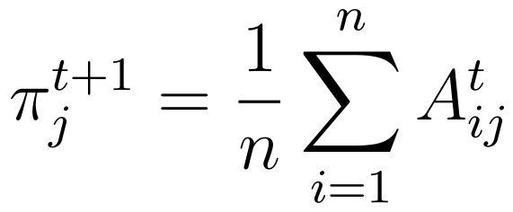
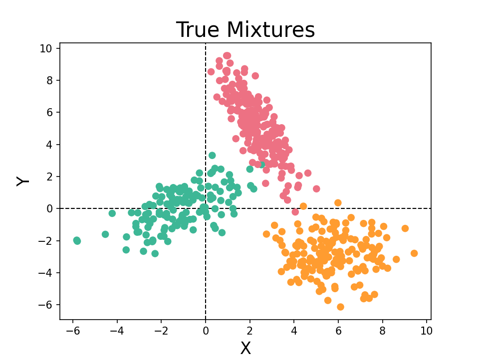
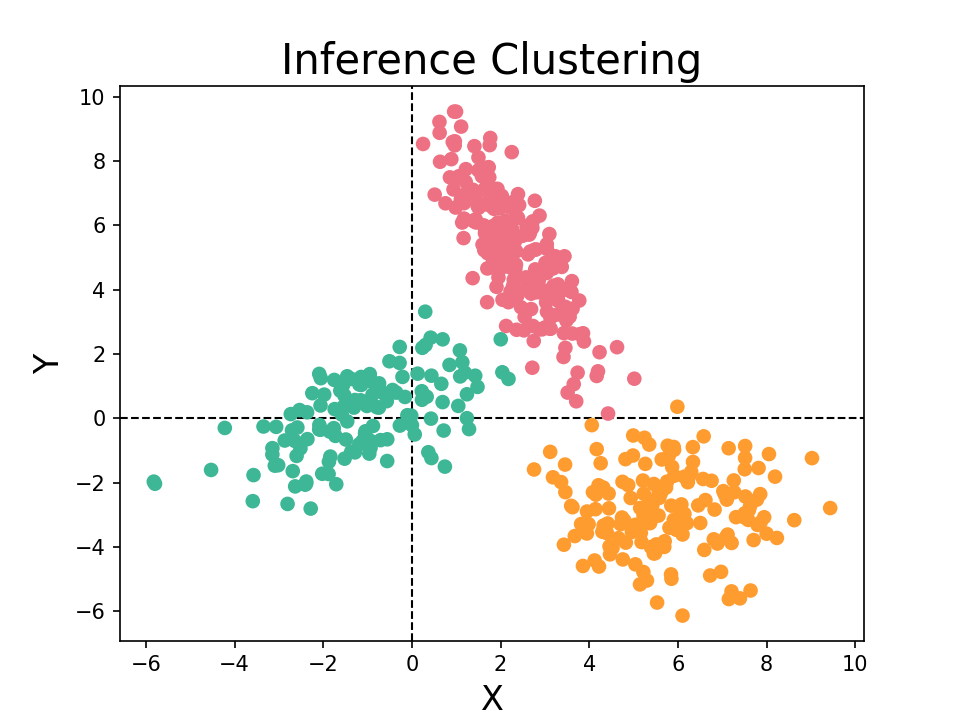

# Multivariate Gaussian Mixture Model (GMM)

The Gaussian Mixture Model (GMM) is a special case of the Expectation–Maximisation (EM) Algorithm. This project shows how to derive the E and M steps for the algorithm and then demonstrates its application for a bivariate Gaussian Mixture.

## Derivation

The E and M steps of the GMM are derived in the general case for any dimensional GMM resulting in the update equations below.

 [Derivation.pdf](./derivation.pdf) contains in-depth derivations for the GMM.


|  |  |  |
|:----------------------------:|:-----------------------------:|:------------------------------:|


## Application

A Haskell program that generates data, learns from it and makes cluster inferences for bivariate Gaussian data is provided.

The program could be extended to any dimension, as discussed within the source code.

### Invoking Instructions

The program can be compiled using `ghc -O2 Main.hs` and run with `./Main`.

This project works with `The Glorious Glasgow Haskell Compilation System, version 9.4.4`.

### Generation

Using a simple linear congruential generator and a few statistical methods, `500` points are generated using the seed `7907`.

Below are the true parameter values:

```
weights = [0.26, 0.41, 0.33]

means = [[ -1,  0.2],
         [2.2,  5.3],
         [5.8, -2.8]]

covariances = [[[   2,    1],
                [   1,  1.4]],

                [[ 0.8, -1.3],
                 [-1.3,  3.4]],

                [[ 1.6,  0.1],
                 [ 0.1,  1.7]]]
```

Below is the generated data, coloured in their mixtures.



### Learning

Here the GMM is run using the generated data along with initial parameter values to find the parameters estimates.

Traditionally the GMM would be run several times with different initial values as the EM algorithm is a hill-climbing algorithm, however, for this project, it is only run once.

Below are the initial parameter values.

```
weights = [0.6, 0.26, 0.14]

means = [[6.2,    0],
         [3.7, -2.4],
         [ 10,  6.1]]

covariances = [[[   3,    0],
                [   0,  0.1]],

               [[ 0.5, -2.2],
                [-2.2,   10]],

               [[ 2.7,  0.6],
                [ 0.6,  5.2]]]
```

Below are the estimated parameter values which are relatively close to the true values above.

```
weights = [0.262, 0.412, 0.326]

means = [[-1.062,  0.088],
         [ 2.316,  5.168],
         [  5.74, -2.851]]

covariances = [[[ 2.467,  1.257],
                [ 1.257,  1.643]],

               [[ 0.784, -1.356],
                [-1.356,  3.599]],

               [[ 1.828, -0.032],
                [-0.032,  1.552]]]
```

### Clustering

The E-step can be used to infer the clusters of the data. Using the parameter estimates found above, the model has an accuracy of `99.4%.`

Below is the data, coloured to how the model clusters them.


